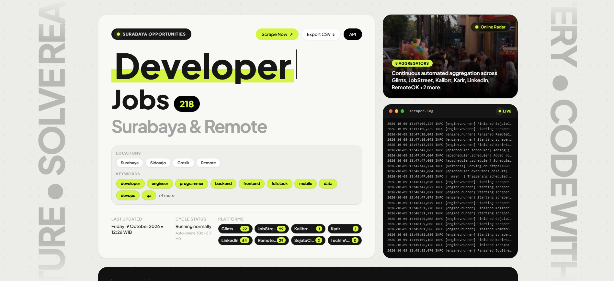

# 🚀 LokerScraper Surabaya

<p align="center">
  
</p>

LokerScraper Surabaya is a high-efficiency automated job vacancy aggregator engineered for 24/7 continuous operation on low-power devices (Armbian TV boxes, Raspberry Pi, home servers) and Docker containers.

The engine harvests job opportunities across 8 major recruitment platforms, performs deterministic deduplication and regional/keyword filtering, dispatches real-time alerts to Discord & Telegram, and serves a modern Swiss-editorial web dashboard alongside a JSON REST API.

---

## ✨ Key Features

- **8-Platform Parallel Scraping**: Concurrent data ingestion from Glints, JobStreet, Kalibrr, Karir.com, LinkedIn, RemoteOK, SejutaCita, and Tech in Asia — entirely headless, zero heavy browser dependencies (no Puppeteer/Playwright overhead).
- **Ultra-Low Memory Footprint**: Idles under `<50 MB` RAM, peaks under `<120 MB` during active parallel cycles.
- **Deterministic Deduplication & Storage**: Pure SQLite database (`data/jobs.db`) with WAL mode (`PRAGMA journal_mode=WAL`), indexed queries, automatic VACUUM pruning, and configurable 30-day retention.
- **Smart N+1 Skipping**: Known jobs recorded in `seen_ids` table bypass detail HTTP roundtrips entirely on repeat runs.
- **Real-Time Notification Dispatch**: Rich embeds delivered to multi-channel Discord Webhooks and Telegram bots with automated error alerting.
- **Editorial Responsive Dashboard**:
  - Live typewriter keyword cycler with responsive font-scaling and lime-highlight emphasis.
  - Interactive search, work mode filters (Remote, Hybrid, On-site), salary sorting, and bookmarks.
  - Built-in live terminal log widget (`scraper.log`) with live polling and auto-fit row trimming.
  - Page jump pagination controls (`Go # →`).
  - Native vertical typographic motivation marquees with edge fade masks.
  - CSV export endpoint (`/api/export`).
- **Secure Remote Access**: Ready for Cloudflare Tunnels (included in Docker compose profile) and private mesh networks (Tailscale/WireGuard). Manual triggers secured via `TRIGGER_TOKEN`.
- **Fault-Tolerant Scheduling**: Background scheduler (APScheduler) with randomized intervals, individual scraper timeouts, and graceful shutdown signal handlers.

---

## 🛠️ System Requirements

- Python 3.10+ (for bare-metal execution) **or**
- Docker & Docker Compose (recommended for 24/7 server / SBC deployment)

---

## 🚀 Quick Start

### Option 1: Docker Compose (Recommended for Production & TV Boxes)

1. **Clone the repository**:
   ```bash
   git clone https://github.com/nothingser0/lokerscraper-surabaya.git
   cd lokerscraper-surabaya
   ```

2. **Configure environment variables**:
   ```bash
   cp .env.example .env
   nano .env
   ```
   *At minimum, set `DISCORD_WEBHOOK_URL` and `TRIGGER_TOKEN`.*

3. **Start the service in background**:
   ```bash
   docker compose up -d --build
   ```

4. **Verify container status**:
   ```bash
   docker compose ps
   docker compose logs -f job-scraper
   ```
   Access the dashboard at `http://localhost:5000` (or `http://[YOUR-DEVICE-IP]:5000`).

---

### Option 2: Native Python Setup

1. **Create and activate a virtual environment**:
   ```bash
   python -m venv venv
   source venv/bin/activate       # Linux / macOS
   # venv\Scripts\activate        # Windows
   pip install -r requirements.txt
   ```

2. **Prepare configuration**:
   ```bash
   cp .env.example .env
   ```

3. **Launch the server**:
   ```bash
   python api/app.py
   ```
   Waitress serves the application at `http://0.0.0.0:5000`.

---

## ⚙️ Environment Configuration (`.env`)

| Variable | Description | Default / Example |
| :--- | :--- | :--- |
| `DISCORD_WEBHOOK_URL` | Primary Discord Webhook URL for alerts | `https://discord.com/api/webhooks/...` |
| `DISCORD_WEBHOOK_URLS` | Comma-separated list for multi-channel broadcast | *Optional* |
| `TELEGRAM_BOT_TOKEN` | Telegram bot token | *Optional* |
| `TELEGRAM_CHAT_ID` | Target Telegram chat ID | *Optional* |
| `TRIGGER_TOKEN` | Secret token required for manual `/api/trigger` | `yoursecrettoken123` |
| `SCRAPE_INTERVAL_HOURS` | Fixed scrape cycle interval (hours) | `6` |
| `SCRAPE_INTERVAL_MIN_HOURS` | Minimum hours for randomized interval | `3` |
| `SCRAPE_INTERVAL_MAX_HOURS` | Maximum hours for randomized interval | `6` |
| `JOB_RETENTION_DAYS` | Automatically prune jobs older than N days | `30` |
| `KEYWORDS` | Target job title / tech keywords (comma-separated) | `developer,engineer,backend,frontend,...` |
| `LOCATIONS` | Accepted geographical locations and work modes | `surabaya,sidoarjo,gresik,remote` |
| `CLOUDFLARE_TUNNEL_TOKEN` | Cloudflare Zero Trust tunnel token for public domain | *Optional* |

---

## 🌐 Public Domain Access (Cloudflare Tunnel)

Expose the dashboard securely without router port-forwarding or public IP exposure:

### Via Docker Compose:
```bash
# Add CLOUDFLARE_TUNNEL_TOKEN to your .env, then run:
docker compose --profile tunnel up -d
```

### Via Native Systemd Service:
```bash
sudo cp cloudflared.service /etc/systemd/system/
sudo systemctl daemon-reload
sudo systemctl enable --now cloudflared.service
```

---

## 📡 REST API Reference

| Endpoint | Method | Description |
| :--- | :--- | :--- |
| `/` | `GET` | Interactive modern web dashboard |
| `/health` | `GET` | Engine health check & scheduler status |
| `/api/stats` | `GET` | Aggregated statistics, platform counts, DB storage & retention |
| `/api/jobs` | `GET` | Filtered job vacancies (`?keyword=`, `?source=`, `?days=`, `?limit=`, `?offset=`) |
| `/api/logs` | `GET` | Real-time scraper log tail (`?lines=60`) |
| `/api/trigger` | `POST` / `GET` | Manually dispatch a scrape cycle (`X-Trigger-Token` header or `?token=`) |
| `/api/export` | `GET` | Download full vacancies dataset in CSV format |

---

## 🧪 System Verification (Smoke Tests)

Validate SQLite storage operations, scraper auto-discovery registry, and live HTTP endpoints:

```bash
python tests/smoke_test.py
```

---

## 📄 License

This project is licensed under the [MIT License](LICENSE).
